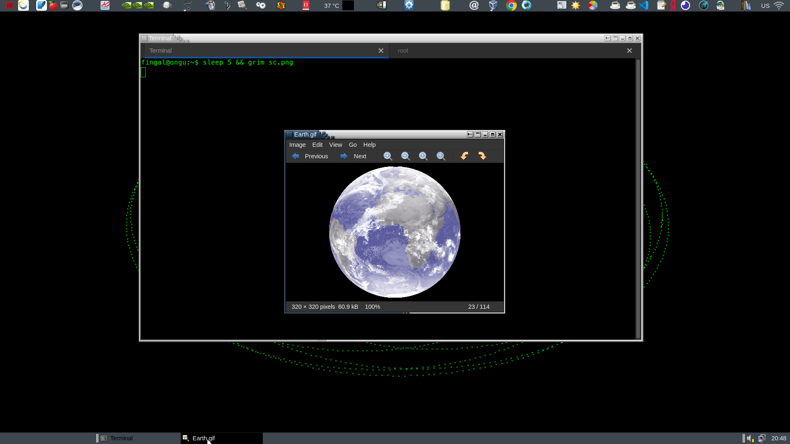
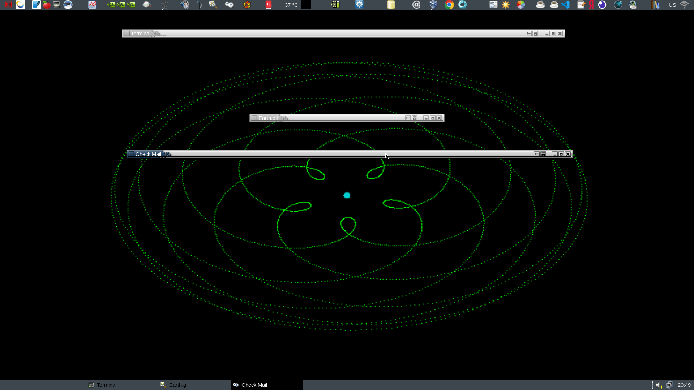

# metacity-decor
[Wayfire]: https://wayfire.org
[marco]: https://wiki.mate-desktop.org/mate-desktop/components/marco/
[wf-external-decoration]:https://github.com/marcof-nikogo/wf-external-decoration
[wcm]:https://github.com/WayfireWM/wcm

A [Wayfire] decoration plugin that renders decorations using the rendering engine of [marco], the Mate Desktop's windows manager.

The same rendering is used too in the latest versions of compiz (gtk-window-decorator).

It parses and renders metacity themes of all versions, i.e. v1, v2 and v3. 

I also made a plugin with a external executable using the same rendering engine: [wf-external-decoration]


## Dependencies

Wayfire 0.8.x

Gtk3 >= 3.24

## Installing

Go to the source folder, setup meson, compile and install.

```sh
$ cd your-path/metacity-decor
$ meson setup build
$ ninja -C build
$ sudo ninja -C build install
```
## Configuration

You can configure the plugin using [wcm], the Wayfire Configuration Manager, or edit the wayfire.ini.

The font must be a string acceptable by **pango_font_description_from_string**, don't forget the size !

The font height determines the height of the buttons.

Normally, a metacity theme takes the title and background colors by the active gtk theme.
But since it is not possible to rely on the gtk theme in a plugin, these are configurable in the plugin options.

The buttons layouts must be in the format: 

``` sh
left_button1,left_button2...:right_button1,right_button2...
```
The supported buttons are: minimize, maximize, close, stick and shade.

NOTE: Not all metacity themes out there support the stick and shade buttons, only those made for marco do.

Metacity themes have a menu button that would be ideal for a menu of actions on the window, but I don't know how to show a menu from a plugin.

## Screenshots

Normal views.



Shaded views.



My theme is a tweaked Crux, I changed the tint of the title area and left side border.  


